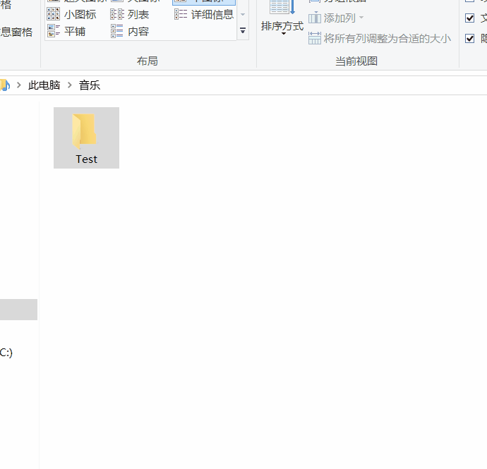

# Folder-locker

这是一个小巧的文件上锁软件，**没有压缩和加密过程**，方便快捷。

## 功能展示



在想加密的文件夹上，右键则可呼出加密面板，输入两次密码确认加密。

在已加密的文件夹上，右键，输入密码，则取消加密

## 项目介绍

项目分了两个目录：

- DButility 用于通过轻量极数据库SQLite 保存密码。
    - 通过Md5算法对密码加密，通过SQL参数防止SQL注入。
- folderLocker 用于实现业务逻辑。
    

## 软件使用

- 下载软件安装包 [Folder Locker.exe](https://github.com/Albert-W/Folder-locker/blob/master/Folder%20Locker.exe)
- 进行安装，建议安装在D盘。
- 可以右键使用，也可以打开软件主页面使用。


注意事项：
- 密码保存在本机数据库，没有上传任何服务器。
- 删除软件会同时删除数据库，因而删除密码。


如果忘记密码：

如果密码遗失，文件被锁，可以通过命令行工具重命名：
```
cd C:\Users\91991\Music
ren "Test.{2559a1f2-21d7-11d4-bdaf-00c04f60b9f0}" "Test1"
```

或者把文件复制出来。

```
cd C:\Users\91991\Music
cd '.\Test.{2559a1f2-21d7-11d4-bdaf-00c04f60b9f0}\'
ls
mv .\* ..\Test1\
```
